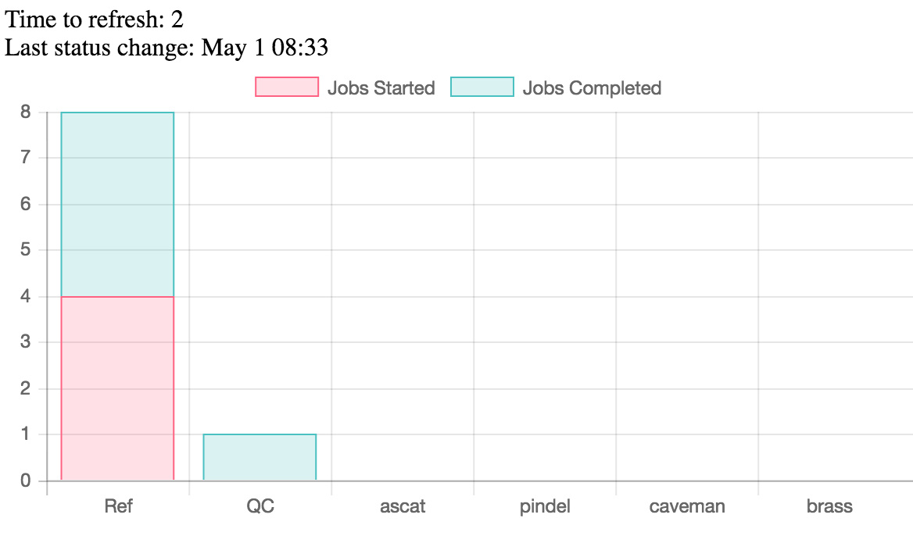

# cgpbox
The __cgpbox__ project encapsulates the core [Cancer Genome Project](http://www.sanger.ac.uk/science/groups/cancer-genome-project) analysis pipeline in an easy to use docker image:

[](https://quay.io/repository/wtsicgp/cgp_in_a_box)

You are also able to run in a standard virtualisation or bare-metal manner, see [INSTALL](INSTALL.md) for details.

| Master | Develop |
|---|---|
| [](https://travis-ci.org/cancerit/cgpbox) |  [](https://travis-ci.org/cancerit/cgpbox) |

The pipeline is optimised for somatic variation calling using ___BWA mem mapped, Illumina paired-end sequencing___.

* [Analysis performed](#analysis-performed)
* [Running the docker image](#running-the-docker-image)
	* [Test run](#test-run)
	* [Running your data](#running-your-data)
* [Input requirements](#input-requirements)
* [Monitoring](#monitoring)
* [Output](#output)
* [Primary analysis software](#primary-analysis-software)
* [AWS setup example](#aws-setup-example)
* [LICENSE](#license)

## Analysis performed

__cgpbox__ will perform the following analysis (not necessarily in this order):

 * Basic genotype call using the standard Sequenom SNP locations
	 * GRCh37 locations [here](https://github.com/cancerit/cgpNgsQc/blob/develop/share/genotype/general.tsv)
 * A comparison of the called genotype between tumour and normal.
 * An evaluation of gender using 4 chrY specific SNPs
	 * GRCh37 locations [here](https://github.com/cancerit/cgpNgsQc/blob/develop/share/genotype/gender.tsv)
	 * not ordered as first 2 are part of standard Sequenom QCplex, additional are included for improved accuracy in patchy sequencing.
 * Copy Number Variation (CNV) using [ascatNgs](https://github.com/cancerit/ascatNgs)
	 * [ASCAT algorithm](https://www.crick.ac.uk/peter-van-loo/software/ASCAT)
 * Insertion and deletion (InDel) calling using [cgpPindel](https://github.com/cancerit/cgpPindel)
	 * A variation of [Pindel](http://gmt.genome.wustl.edu/packages/pindel/)
 * Single Nucleotide Variant (SNV) calling using [CaVEMan](https://github.com/cancerit/CaVEMan)
	 * Post-processing via [cgpCaVEManPostProcessing](https://github.com/cancerit/cgpCaVEManPostProcessing)
 * Gene annotation of SNV and InDel calls using [VAGrENT](https://github.com/cancerit/VAGrENT)
 * Structural Variation (SV) calls using [BRASS](https://github.com/cancerit/BRASS)
	 * Basic gene annotation via [grass](https://github.com/cancerit/grass)

## Running the docker image
The bulk of this repository is to manage the building of a docker image so that users don't have to.

Provided you have a base system configured to run docker then you only need to fulfil the following requirements:

 1. Ability to provide large workspace as a volume mount point.
	 * Workspace needs to be ~25% of the sum of your BAM inputs.
	 * Normally it is simplest to place the BAMs in the same area.
 1. 24 cores or more for sensible turn around times.
 1. ~4GB RAM per core

The required resources are unfortunately large but the system does run many elements in parallel to reduce wall-time.

-----

### Test run

__The current test dataset takes quite a long time to run.  We are working to find more suitable data that we can share.  Please see [Running your data](running-your-data) to use your own sample pair.__

To run the pre-built docker image with the test data log into a docker enabled host and run the following:

````
$ cd ~
$ curl -sSL --retry 10 -O https://raw.githubusercontent.com/cancerit/cgpbox/master/examples/run.params
$ export MOUNT_POINT=/some/large/storage
$ (docker run --rm -v $MOUNT_POINT:/datastore -v ~/run.params:/home/ubuntu/run.params quay.io/wtsicgp/cgp_in_a_box > ~/run.out) >& ~/run.err &
````
`$MOUNT_POINT` should be a storage area with ~25GB of space for this test.

Result files will be written to `$MOUNT_POINT/analysis` (unless you modify the param file).

### Running your data

To analyse your own pairs of tumour normal BAM files you can modify the example `run.params` file indicated in [Test run](#test-run).

The `run.params` file contains comments to assist you but here are the critical items:

* `NAME_*` - Should match the sample names found in the headers of the BAM files.
* `*_MT` - Refers to data linked to the MuTant/tumour sample.
* `*_WT` - Refers to data linked to the WildType/Normal sample.
* `BAM_*` - Paths to the input BAM files, path is that found within the docker image.

You are also able to force the CPU count to be a specified value.  By default the image will use all cores available to the docker image.  Should you need to make more memory available you can force a CPU value to be lower than the actual by specifying the value you want as `CPU=4` (uncommenting if needed).

Please see [Input requirements](#input-requirements).

#### PRE-EXEC array

This is an optional section to provide actions that should be performed ___prior___ to the main analysis being triggered.  In the example `run.params` this downloads and unpacks the test dataset.

The uses are only limited by the tools available within the docker image (S3 tools are already included).  If there is a good case for additional tools please raise an issue.

If not needed comment out or delete.

#### POST-EXEC array

This is an optional section to provide actions that should be performed ___after___ to the main analysis being triggered.  In the example `run.params` this shows how you could automatically trigger an upload to an S3 bucket.

The uses are only limited by the tools available within the docker image (S3 tools are already included).  If there is a good case for additional tools please raise an issue.

If not needed comment out or delete.

#### Other params not documented here
There are some other parameters that have not been documented here as they relate to future features. Basic notes are included with all parameters in [`examples/run.params`](examples/run.params).

### Input requirements
__cgpbox__ expects to be provided with a pair of BAM files (one tumour, one normal) each:

* Mapped with BWA-mem
	* Having valid ReadGroup headers including LB and SN tags
	* See SAM/BAM specification [here](https://samtools.github.io/hts-specs/SAMv1.pdf) for more details.
* Duplicates marked.
* BAM indexes created.

### Data mapped in different fashion
Data mapped using a different algorithm _may_ process successfully however we are unlikely to be able to provide detailed support.

If you already have a mapped BAM you can re-map with all of the above handled for you using the `bwa_mem.pl` script which is part of [PCAP-core](https://github.com/ICGC-TCGA-PanCancer/PCAP-core).

## Monitoring
A simple webpage has been created so that you can monitor the progress of your job.  It simply provides evidence that things are progressing and requires the base host (not the docker) to have python installed:

````
$ cd $MOUNT_POINT/site
$ sudo python -m SimpleHTTPServer 80 >& ~/monitor.log&
````

Then point you browser at:

````
http://yourhost/html/index.html
````
--

--

--

## Output

On completion the data files used to generate the web-site are copied into the output location along with files containing timing/memory data.  These can be found at `$MOUNT_POINT/output/*.time` and are of the form:

````
$ cat ascat.time
command:ascat.pl -o /datastore/output/HCC1143_vs_HCC1143_BL/ascat -t /datastore/output/tmp/HCC1143.bam -n /datastore/output/tmp/HCC1143_BL.bam -s /datastore/reference_files/ascat/SnpLocus.tsv -sp /datastore/reference_files/ascat/SnpPositions.tsv -sg /datastore/reference_files/ascat/SnpGcCorrections.tsv -r /datastore/reference_files/genome.fa -q 20 -g L -rs Human -ra GRCh37 -pr WGS -pl ILLUMINA -c 8
real:1390.62
user:2106.95
sys:40.48
text:0k
data:0k
max:2183804k
````

Additionally all of the data in the output folder is packaged as a tar.gz for easy retrieval (example data set: `$MOUNT_POINT/result_HCC1143_vs_HCC1143_BL.tar.gz`).  Please see `examples/run.params` for an example of using post-exec to push your data to AWS.

## Primary analysis software

It incorporates the following ___cancerit___ projects:

 * [cgpVcf](https://github.com/cancerit/cgpVcf)
 * [alleleCount](https://github.com/cancerit/alleleCount)
 * [cgpNgsQc](https://github.com/cancerit/cgpNgsQc)
 * [ascatNgs](https://github.com/cancerit/ascatNgs)
 * [cgpPindel](https://github.com/cancerit/cgpPindel)
 * [cgpCaVEManPostProcessing](https://github.com/cancerit/cgpCaVEManPostProcessing)
 * [CaVEMan](https://github.com/cancerit/CaVEMan)
 * [cgpCaVEManWrapper](https://github.com/cancerit/cgpCaVEManWrapper)
 * [VAGrENT](https://github.com/cancerit/VAGrENT)
 * [grass](https://github.com/cancerit/grass)
 * [BRASS](https://github.com/cancerit/BRASS)

### Dependancies

Additionally these have dependancies on the following software packages which may have different license restrictions to the ___cancerit___ packages:

* [PCAP-core](https://github.com/ICGC-TCGA-PanCancer/PCAP-core) - maintained by ___cancerit___
* [kentUtils](https://github.com/ENCODE-DCC/kentUtils)
* [BWA](https://github.com/lh3/bwa)
* [biobambam2](https://github.com/gt1/biobambam2)
* [htslib](https://github.com/samtools/htslib)
* [tabix](https://github.com/samtools/tabix)
* [bedtools2](https://github.com/arq5x/bedtools2)
* [verifyBamID](https://github.com/statgen/verifyBamID)
* [blat](https://genome.ucsc.edu/FAQ/FAQblat.html)
* [velvet](https://github.com/dzerbino/velvet)
* [exonerate](https://github.com/nathanweeks/exonerate)
* [fasta36](https://github.com/wrpearson/fasta36) - only `ssearch36`


LICENSE
=======
Copyright (c) 2016 Genome Research Ltd.

Author: Cancer Genome Project <cgpit@sanger.ac.uk>

This file is part of cgpbox.

cgpbox is free software: you can redistribute it and/or modify it under
the terms of the GNU Affero General Public License as published by the Free
Software Foundation; either version 3 of the License, or (at your option) any
later version.

This program is distributed in the hope that it will be useful, but WITHOUT
ANY WARRANTY; without even the implied warranty of MERCHANTABILITY or FITNESS
FOR A PARTICULAR PURPOSE. See the GNU Affero General Public License for more
details.

You should have received a copy of the GNU Affero General Public License
along with this program. If not, see <http://www.gnu.org/licenses/>.

1. The usage of a range of years within a copyright statement contained within
this distribution should be interpreted as being equivalent to a list of years
including the first and last year specified and all consecutive years between
them. For example, a copyright statement that reads ‘Copyright (c) 2005, 2007-
2009, 2011-2012’ should be interpreted as being identical to a statement that
reads ‘Copyright (c) 2005, 2007, 2008, 2009, 2011, 2012’ and a copyright
statement that reads ‘Copyright (c) 2005-2012’ should be interpreted as being
identical to a statement that reads ‘Copyright (c) 2005, 2006, 2007, 2008,
2009, 2010, 2011, 2012’."
